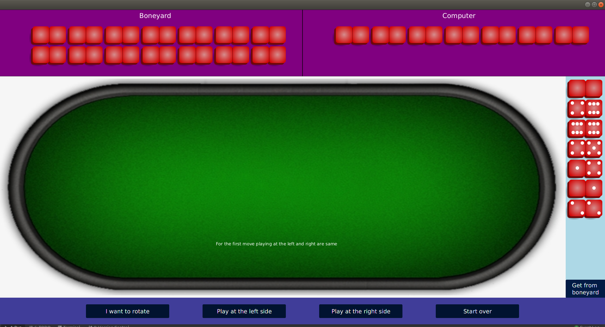
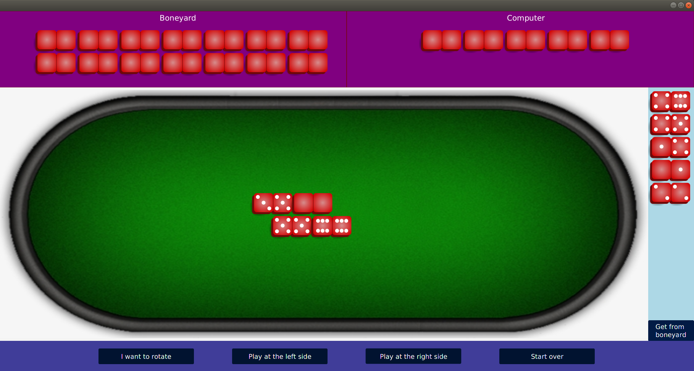
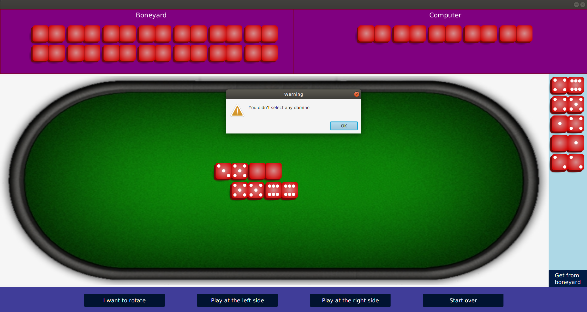
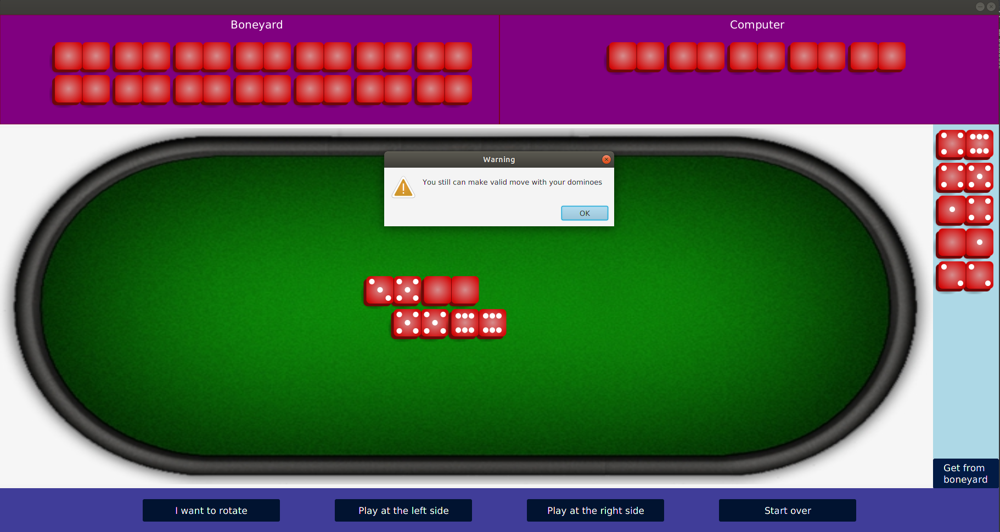
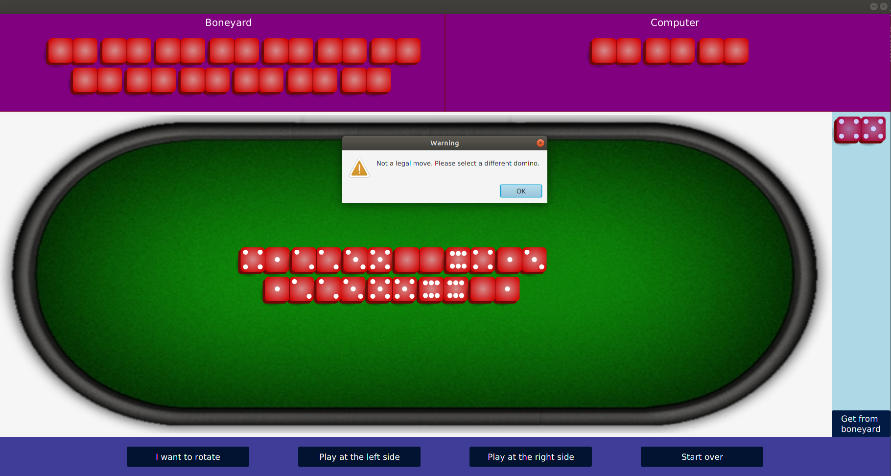
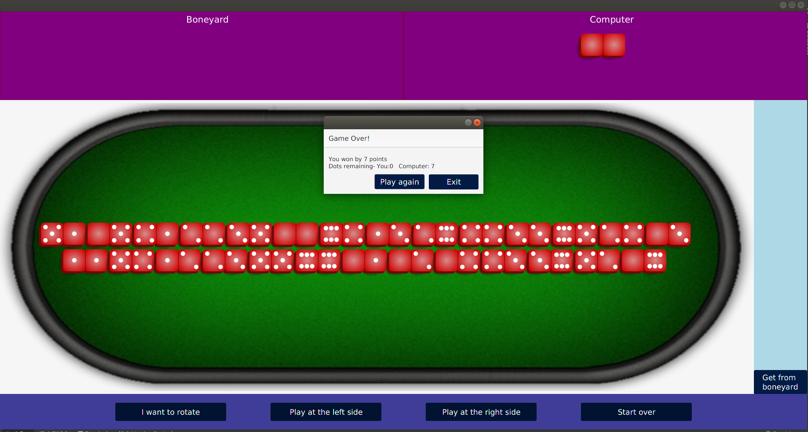

Domino Game
===

**Game rules**
*There are multiple versions of domino game with slight changes with the rules. This version  
of the game is the simplest domino game. The rules are as follows*

* The game starts with all the dominos being placed face down on the table and mixed  
around. This is called the boneyard.
* Each player selects 7 dominos and places them on the long edge so as to be able to see  
them without being visible to the opponent.
* One player starts the game by downing (putting down) a domino face-up on the table.
* The players take turns.
* On each turn, the player downs a single domino matching the configuration on the table.
* The dominos will form two parallel rows shifted by half a domino.
* Two adjacent dominos located on different rows must have the same value in the  
overlapping halves.
* A blank is used as a wild card and thus matches any value next to it.
* If the player has a domino that can extend the line of play in either direction, they put  
it down and their turn ends.
* If the player does not have a domino able to extend the line of play, they must pick one  
up from the boneyard and must continue to do so until a matching domino is found or  
the boneyard is empty.
   1. If the player has a domino able to extend the line of play, they cannot pick any pieces  
      from the boneyard.
   2. If the boneyard is empty and the player cannot extend the line of play, they end their  
      turn.
* The game ends when the boneyard is empty and either
   1. The current player places their last domino.
   2. Both players have taken a turn without placing a domino.
* At the end of the game, the dots on each players dominos are counted and the player  
with the lower total wins. (This means that is one player ends the game without any  
dominos, they’re pretty much guaranteed to be the winner.)

---

**Game features and how to play**

* The above rules are followed throughout the game.
* Human player plays against the computer and make the first move.
* Human player can choose domino clicking on a domino that he/she possess.
* There are buttons to rotate domino, to play at left side, to play at right side, to start over the game.
* There is a button to take domino from boneyard.
* Dominoes of boneyard and computer player are also listed, but the numbers are not shown.
* When the game ends, there are options to start a new game or exit the game.
* Also the game over dialog box shows who won and by how many points.
* At any point if user tries to take an invalid action, there are alerts to show why the action is invalid.

---

**Fetaures not implementes**

* Use of sound.
* Different levels of difficulty.
* A start pane when the game is first launched where user can click a button to start the game  
after selecting the difficulty level.

---

**A small bug and way to avoid**
*If you clone the entire repo and try to play the game compiling manually without using the .jar file  
please move the table3.png file from resources folder to src/dominos/ folder. Otherwise the program won't run.*

---

